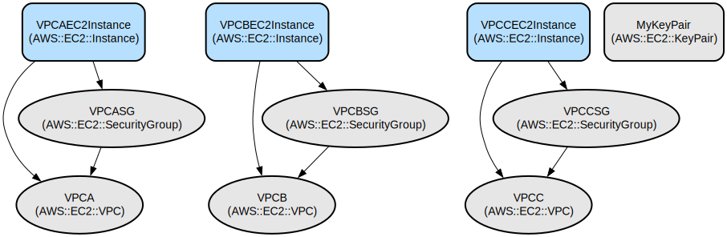

# AWS Multi-VPC Networking Infrastructure as Code with CDK

This project implements a networking proof-of-concept (POC) environment using AWS CDK that creates multiple interconnected VPCs with EC2 instances. It demonstrates infrastructure as code practices for setting up secure and isolated network environments with controlled access patterns.

The solution creates three VPCs with public and private subnets, each containing an EC2 instance with specific security group rules for SSH and ICMP access. The infrastructure is defined using AWS CDK in Python, providing a reusable and maintainable way to deploy consistent networking environments. Each VPC is configured with NAT gateways and internet gateways, enabling secure outbound internet access while maintaining network isolation.

## Repository Structure
```
.
├── app.py                      # Main CDK application entry point
├── networking_poc/             # Core infrastructure code
│   └── networking_poc_stack.py # Main stack definition with VPC and EC2 configurations
├── tests/                      # Test directory
│   └── unit/                   # Unit tests for the infrastructure
├── cdk.json                    # CDK configuration and context
├── requirements.txt            # Production dependencies
└── requirements-dev.txt        # Development dependencies
```

## Usage Instructions
### Prerequisites
- Python 3.6 or higher
- AWS CLI configured with appropriate credentials
- AWS CDK CLI installed (`npm install -g aws-cdk`)
- An AWS account with permissions to create:
  - VPCs
  - EC2 instances
  - Security Groups
  - IAM roles
  - Key pairs

### Installation

1. Clone the repository and create a virtual environment:
```bash
# Create and activate virtual environment
python -m venv .venv
source .venv/bin/activate  # On Windows use: .venv\Scripts\activate
```

2. Install dependencies:
```bash
pip install -r requirements.txt
pip install -r requirements-dev.txt
```

3. Bootstrap CDK in your AWS account (if not already done):
```bash
cdk bootstrap aws://ACCOUNT-NUMBER/REGION
```

### Quick Start

1. Review and update VPC configurations in `networking_poc_stack.py` if needed:
```python
vpc_configs = [
    {
        "name": "A",
        "cidr": "10.0.0.0/16",
        # ... other configurations
    }
]
```

2. Deploy the stack:
```bash
cdk deploy
```

3. After deployment, note the outputs for:
- VPC IDs
- EC2 Instance IDs
- Key pair name

### More Detailed Examples

Creating a custom VPC configuration:
```python
vpc_config = {
    "name": "Custom",
    "cidr": "172.16.0.0/16",
    "public_subnet_cidrs": 24,
    "private_subnet_cidrs": 24,
    "ssh_allowed_ips": ["YOUR-IP/32"],
    "icmp_allowed_ips": ["172.16.0.0/16"]
}
```

### Troubleshooting

Common Issues:

1. CDK Bootstrap Error
```
Error: This stack uses assets, so the toolkit stack must be deployed to the environment
```
Solution:
```bash
cdk bootstrap aws://ACCOUNT-NUMBER/REGION
```

2. VPC Deployment Failure
- Check if the CIDR ranges don't overlap
- Verify you have sufficient VPC limits in your account
- Enable CDK debug logs:
```bash
cdk deploy --debug
```

3. EC2 Connection Issues
- Verify security group rules
- Check if the key pair was properly created
- Ensure your IP is in the allowed SSH CIDR ranges

## Data Flow

The networking infrastructure creates isolated VPCs with controlled communication paths between them. Each VPC contains public and private subnets with NAT gateways for secure outbound access.

```ascii
                                    Internet
                                       │
                                       ▼
                     ┌─────────────────┴─────────────────┐
                     │        Internet Gateway           │
                     └─────────────────┬─────────────────┘
                                      │
         ┌──────────────────┬─────────┴────────┬──────────────────┐
         ▼                  ▼                  ▼                   ▼
    ┌────────┐        ┌────────┐         ┌────────┐         ┌────────┐
    │ VPC A  │◄─────►│ VPC B  │◄───────►│ VPC C  │         │  NAT   │
    └────────┘        └────────┘         └────────┘         └────────┘
```

Key Component Interactions:
1. VPCs are isolated but allow ICMP traffic between them based on configuration
2. Each VPC contains both public and private subnets
3. EC2 instances in public subnets have direct internet access
4. Private subnet resources use NAT gateway for outbound traffic
5. SSH access is restricted to specified IP ranges
6. ICMP (ping) traffic is allowed between VPCs
7. All VPCs share the same key pair for EC2 access

## Infrastructure



### VPC Resources
- 3 VPCs with CIDR blocks: 10.0.0.0/16, 10.1.0.0/16, 10.2.0.0/16
- Each VPC contains:
  - Public subnets (/24)
  - Private subnets (/24)
  - NAT Gateway
  - Internet Gateway

### EC2 Resources
- Instance Type: t2.micro
- Amazon Linux 2 AMI
- Security Groups with:
  - SSH access from specified IPs
  - ICMP access between VPCs

### IAM Resources
- EC2 instance roles
- Key pair for SSH access

## Deployment

1. Prerequisites:
- AWS credentials configured
- CDK bootstrapped in target account

2. Deployment Steps:
```bash
cdk diff        # Review changes
cdk deploy     # Deploy stack
```

3. Monitoring:
- Check CloudFormation console for deployment status
- Monitor EC2 instance status in AWS Console
- Verify VPC peering connections are active# networking_poc
# networking_poc
# networking_poc
# networking_poc
# networking_poc
# networking_poc
